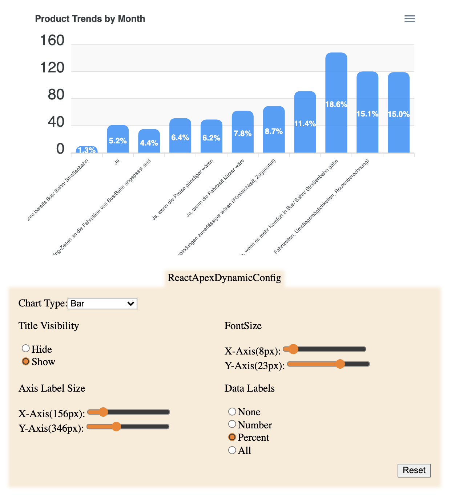
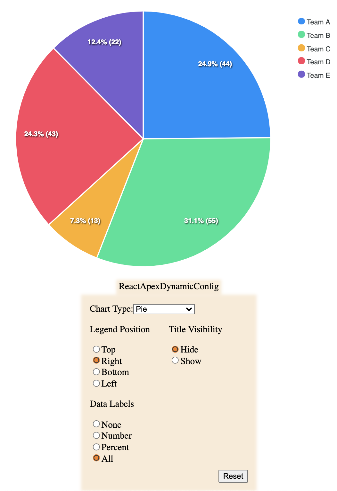
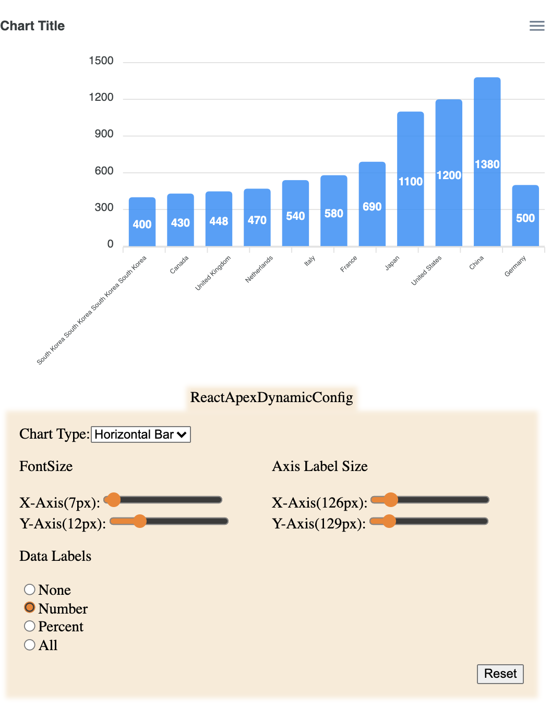

# React Apex Chart Dynamic Config

> Configure react apex chart options dynamically

[](https://www.npmjs.com/package/@paraboly/react-apexcharts-dynamic-config) [](https://standardjs.com)

| Example 1                                   |                  Example 2                  |                  Example 3                  |
| ------------------------------------------- | :-----------------------------------------: | :-----------------------------------------: |
|  |  |  |

## Install

```bash
npm install --save @paraboly/react-apexcharts-dynamic-config
```

## Usage

```tsx
import React from 'react';
import ReactApexDynamicConfig from '@paraboly/react-apexcharts-dynamic-config';

const example = (): React.ReactElement => {
  //ApexCharts.ApexOptions
  const options = {
    chart: {
      type: 'pie',
    },
    title: {
      text: 'Chart Title',
    },
    labels: ['Team A', 'Team B', 'Team C', 'Team D', 'Team E'],
    legend: {
      position: 'bottom',
    },
  };

  return (
    <ReactApexDynamicConfig
      options={options}
      onChange={(opt) => console.log(opt)}
    />
  );
};

export default example;
```

## Details

| Props        |          Definition          |                                           Type |              Default | Required |
| ------------ | :--------------------------: | ---------------------------------------------: | -------------------: | -------: |
| options      |  Initial apex chart options  |                       `ApexCharts.ApexOptions` |                 null |     true |
| translations | Translations key value pair  |                       `Record<string, string>` | DEFAULT_TRANSLATIONS |    false |
| onChange     | Callback for updated options | `(updatedOpt: ApexCharts.ApexOptions) => void` |                 null |     true |

DEFAULT_TRANSLATIONS

```json
{
  "reset": "Reset",
  "show": "Show",
  "hide": "Hide",
  "none": "None",
  "number": "Number",
  "percent": "Percent",
  "all": "All",
  "top": "Top",
  "right": "Right",
  "bottom": "Bottom",
  "left": "Left",
  "xaxis": "X-Axis",
  "yaxis": "Y-Axis",
  "legendPosition": "Legend Position",
  "titleVisibility": "Title Visibility",
  "fontSize": "FontSize",
  "axisLabelSize": "Axis Label Size",
  "dataLabels": "Data Labels"
}
```

## License

MIT © [SchemeSonic](https://github.com/SchemeSonic)@[Paraboly](https://www.paraboly.com)
